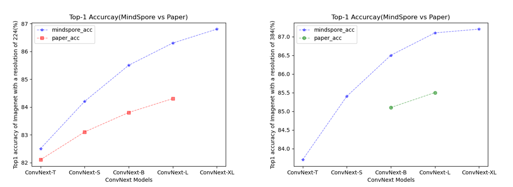

# ConvNext

***

In January 2022, Facebook AI research and UC Berkeley jointly published an article called a convnet for the 2020s. In this article, convnext pure convolutional neural network is proposed, Compared with the current popular swing transformer, a series of experiments show that convnext achieves higher reasoning speed and better accuracy under the same flops.

The architectural definition of network refers to the following papers:

[1] Liu Z , Mao H , Wu C Y , et al. [A ConvNet for the 2020s](https://arxiv.org/pdf/2201.03545v2.pdf). 2022.

## Performance

### Precision comparison line chart

The following line chart shows the accuracy comparison between convnext network and paper in Top1.



## Pretrained models

***

The following table lists all ConvNext imagenet checkpoints. Each model verifies the accuracy of Top-1, and compares it with that of Paper.

|  | | MindSpore |MindSpore | Paper | Paper | | |
|:-----:|:---------:|:---------:|:---------:|:---------:|:---------:|:--------:|:--------:|
| Model | resolution | Top-1 (%) |Top-5 (%) | Top-1 (%) |Top-5 (%) | Download | Config |
| ConvNext-T |224x224|82.5|96.5|82.1|/| [model](https://download.mindspore.cn/vision/convnext/convnext_tiny_22k_1k_224.ckpt) |[config](https://gitee.com/mindspore/vision/blob/master/mindvision/classification/config/convnext/convnext_tiny_imagenet2012.yaml)|
| ConvNext-T |384x384|83.7|97.0|/|/|[model](https://download.mindspore.cn/vision/convnext/convnext_tiny_22k_1k_384.ckpt) |[config](https://gitee.com/mindspore/vision/blob/master/mindvision/classification/config/convnext/convnext_tiny_imagenet2012.yaml)|
| ConvNext-S |224x224|84.2|97.3|83.1|/| [model](https://download.mindspore.cn/vision/convnext/convnext_small_22k_1k_224.ckpt) |[config](https://gitee.com/mindspore/vision/blob/master/mindvision/classification/config/convnext/convnext_small_imagenet2012.yaml)|
| ConvNext-S |384x384|85.4|97.7|/|/|[model](https://download.mindspore.cn/vision/convnext/convnext_small_22k_1k_384.ckpt) |[config](https://gitee.com/mindspore/vision/blob/master/mindvision/classification/config/convnext/convnext_small_imagenet2012.yaml)|
| ConvNext-B |224x224|85.5|97.7|83.8|/| [model](https://download.mindspore.cn/vision/convnext/convnext_base_22k_1k_224.ckpt) |[config](https://gitee.com/mindspore/vision/blob/master/mindvision/classification/config/convnext/convnext_base_imagenet2012.yaml)|
| ConvNext-B |384x384|86.5|98.0|85.1|/|[model](https://download.mindspore.cn/vision/convnext/convnext_base_22k_1k_384.ckpt) |[config](https://gitee.com/mindspore/vision/blob/master/mindvision/classification/config/convnext/convnext_base_imagenet2012.yaml)|
| ConvNext-L |224x224|86.3|97.9|84.3|/| [model](https://download.mindspore.cn/vision/convnext/convnext_large_22k_1k_224.ckpt) |[config](https://gitee.com/mindspore/vision/blob/master/mindvision/classification/config/convnext/convnext_large_imagenet2012.yaml)|
| ConvNext-L |384x384|87.1|98.2|85.5|/|[model](https://download.mindspore.cn/vision/convnext/convnext_large_22k_1k_384.ckpt) |[config](https://gitee.com/mindspore/vision/blob/master/mindvision/classification/config/convnext/convnext_large_imagenet2012.yaml)|
| ConvNext-XL |224x224|86.8|98.1|/|/| [model](https://download.mindspore.cn/vision/convnext/convnext_xlarge_22k_1k_224_ema.ckpt) |[config](https://gitee.com/mindspore/vision/blob/master/mindvision/classification/config/convnext/convnext_xlarge_imagenet2012.yaml)|
| ConvNext-XL |384x384|87.2|98.3|/|/|[model](https://download.mindspore.cn/vision/convnext/convnext_xlarge_22k_1k_384_ema.ckpt) |[config](https://gitee.com/mindspore/vision/blob/master/mindvision/classification/config/convnext/convnext_xlarge_imagenet2012.yaml)|

## Training

***

### Parameter description

| Parameter | Default | Description |
|:-----|:---------|:--------|
| model | convnext_base | Which model you want to train |
| device_target | GPU | Device type |
| device_id | 0 | Currently running card number |
| data_url | /data0/imagenet2012 | Location of data |
| epoch_size | 90 | Number of train epoch |
| pretrained | False | Load pretrained model |
| keep_checkpoint_max | 10 | Max number of checkpoint files |
| ckpt_save_dir | ./convnext | Location of training outputs |
| num_parallel_workers | 1 | Number of parallel workers |
| batch_size | 64 | Number of batch size |
| repeat_num | 1 | Number of repeat |
| num_classes | 1000 | Number of classification |
| lr_decay_mode | cosine_annealing_lr_v1 | Learning rate decay mode |
| lr | 4e-3 | Base learning rate |
| lr_layer_scale | 1.0 | learning rate decay for layers |
| weight_decay | 1e-5 | weight decay value |
| warmup_epochs | 20 | Number of classification |
| dataset_sink_mode | False | The dataset sink mode |
| run_distribute | True | Run distribute |
| resize | 224 | Resize the image |

## Examples

***

### Train

- The following configuration for training.

```shell
mpirun -n 8 python train.py --model convnext_base --data_url /data0/imagenet2012
```

  output:

  ```text
    Epoch:[0/90], step:[2502/2502], loss:[6.946/6.946], time:1095568.310, lr:0.0049
    Epoch time:1106626.360, per step time:442.292, avg loss:6.946
    Epoch:[1/90], step:[2502/2502], loss:[6.885/6.885], time:1091818.493, lr:0.0048
    Epoch time:1091981.163, per step time:438.975, avg loss:6.885
    Epoch:[2/90], step:[2502/2502], loss:[7.026/7.026], time:1094093.746, lr:0.0047
    Epoch time:1094096.121, per step time:437.289, avg loss:7.026
    ...
  ```

- The following configuration uses yaml file for training.

```shell
  mpirun -n 8 python examples/classification/tools/train_config.py -c mindvision/classification/config/convnext/convnext_base_imagenet2012.yaml
  ```

output:

```text
    Epoch:[0/90], step:[2502/2502], loss:[6.998/6.998], time:1095569.976, lr:0.0049
    Epoch time:1106618.839, per step time:445.289, avg loss:6.946
    Epoch:[1/90], step:[2502/2502], loss:[6.885/6.885], time:1091877.306, lr:0.0048
    Epoch time:1091489.861, per step time:436.539, avg loss:6.885
    Epoch:[2/90], step:[2502/2502], loss:[7.026/7.026], time:1093903.073, lr:0.0047
    Epoch time:1093905.668, per step time:437.212, avg loss:7.026
    ...
```

### Eval

- After training, you can use test set to evaluate the performance of your model. Run eval.py to achieve this. The usage of model_type parameter is same as training process.

```text
python eval.py --model convnext_base --data_url /data0/imagenet2012 --ckpt_file /home/convnet/train/ms_file/convnext_base_22k_1k_224.ckpt --num_parallel_workers 1
```

output:

```text
{'Top_1_Accuracy':0.8552283653846153,'Top_5_Accuracy':0.9777644230769231}
```

- The following configuration uses yaml file for eval.

```shell
  python examples/classification/tools/eval_config.py -c mindvision/classification/config/convnext/convnext_base_imagenet2012.yaml
```

output:

```text
{'Top_1_Accuracy':0.8552283653846153,'Top_5_Accuracy':0.9777644230769231}
```

### Infer

- At last, you can use your own image to test your model. Put your image in the infer_image folder, then run infer.py to do inference.

```shell
python infer.py --model convnext_base --data_url /data0/imagenet2012 --ckpt_file /home/convnet/train/ms_file/convnext_base_22k_1k_224.ckpt
```

output:

```text
  {0: 'tench'}
  ```

<div align=center></div>