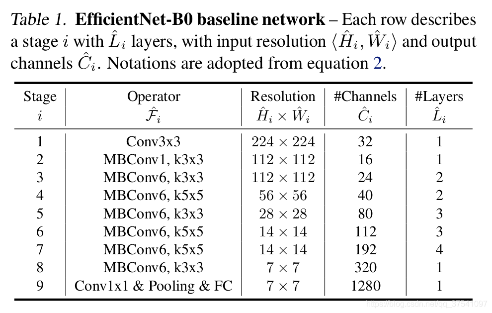

# EfficientNet

***

Convolutional Neural Networks (ConvNets) are commonly developed at a fixed resource budget, and then scaled up for better accuracy if more resources are available. In this paper, we systematically study model scaling and identify that carefully balancing network depth, width, and resolution can lead to better performance. Based on this observation, we propose a new scaling method that uniformly scales all dimensions of depth/width/resolution using a simple yet highly effective compound coefficient. We demonstrate the effectiveness of this method on scaling up MobileNets and ResNet. To go even further, we use neural architecture search to design a new baseline network and scale it up to obtain a family of models, called EfficientNets, which achieve much better accuracy and efficiency than previous ConvNets.

The architectural definition of each network refers to the following papers:

[1] Tan M, Le Q. [Efficientnet: Rethinking model scaling for convolutional neural networks](http://proceedings.mlr.press/v97/tan19a.html) [C] //International conference on machine learning. PMLR, 2019: 6105-6114.

<div align=center></div>

## Performance

***

### Precision comparison line chart

The following line chart shows the accuracy comparison of EfficientNetV1 network in Top1 and Top5 of MindSpore and Top1 of TensorFlow.

<div align=center></div>

## pretrained models

***

The following table lists all EfficientNet imagenet checkpoints. Each model verifies the accuracy
of Top-1 and Top-5, and compares it with that of TensorFlow.

|                 |MindSpore |MindSpore |TensorFlow | | |
|:---------------:|:---------:|:---------:|:---------:|:------:|:------:|
|      Model      | Top-1 (%) | Top-5 (%) | Top-1 (%) | Config | Download |
| efficientnet_b0 | 77.4 | 93.4 | 77.1 | [config](../../../mindvision/classification/config/efficientnet/efficientnet_b0.yaml) | [model](https://download.mindspore.cn/vision/classification/efficientnet_b0_1_1_224_0.2.ckpt) |
| efficientnet_b1 | 78.4 | 94.2 | 79.1 | [config](../../../mindvision/classification/config/efficientnet/efficientnet_b1.yaml) | [model](https://download.mindspore.cn/vision/classification/efficientnet_b1_1_1.1_240_0.2.ckpt) |
| efficientnet_b2 | 80.3 | 95.0 | 80.1 | [config](../../../mindvision/classification/config/efficientnet/efficientnet_b2.yaml) | [model](https://download.mindspore.cn/vision/classification/efficientnet_b2_1.1_1.2_260_0.3.ckpt) |
| efficientnet_b3 | 81.9 | 96.0 | 81.6 | [config](../../../mindvision/classification/config/efficientnet/efficientnet_b3.yaml) | [model](https://download.mindspore.cn/vision/classification/efficientnet_b3_1.2_1.4_300_0.3.ckpt) |
| efficientnet_b4 | 83.2 | 96.4 | 82.9 | [config](../../../mindvision/classification/config/efficientnet/efficientnet_b4.yaml) | [model](https://download.mindspore.cn/vision/classification/efficientnet_b4_1.4_1.8_380_0.4.ckpt) |
| efficientnet_b5 | 82.8 | 96.4 | 83.6 | [config](../../../mindvision/classification/config/efficientnet/efficientnet_b5.yaml) | [model](https://download.mindspore.cn/vision/classification/efficientnet_b5_1.6_2.2_456_0.4.ckpt) |
| efficientnet_b6 | 83.6 | 96.6 | 84.0 | [config](../../../mindvision/classification/config/efficientnet/efficientnet_b6.yaml) | [model](https://download.mindspore.cn/vision/classification/efficientnet_b6_1.8_2.6_528_0.5.ckpt) |
| efficientnet_b7 | 83.5 | 96.6 | 84.3 | [config](../../../mindvision/classification/config/efficientnet/efficientnet_b7.yaml) | [model](https://download.mindspore.cn/vision/classification/efficientnet_b7_2.0_3.1_600_0.5.ckpt) |

## Training

***

### Parameter description

| Parameter | Default | Description |
|:-----|:---------|:--------|
| device_target | GPU | Hardware device |
| data_url |  | Path to training dataset |
| pretrained | False | Path to pretrained model |
| run_distribute | True | Distributed parallel training |
| num_parallel_workers | 8 | Number of parallel workers |
| dataset_sink_mode | False | Data sinking mode |
| num_classes | 1000 | Number of dataset classifications |
| batch_size | 64 | Number of batch size |
| repeat_num | 1 | Number of data repetitions |
| momentum | 0.9 | Momentum parameter |
| epoch_size | 300 | Number of epoch |
| keep_checkpoint_max | 10 | Maximum number of checkpoints saved |
| ckpt_save_dir | './efficientnet' | Save path of checkpoint |
| lr_decay_mode | cosine_decay_lr | Learning rate decay mode |
| decay_epoch | 300 | Number of decay epoch |
| smooth_factor | 0.1 | Label smoothing factor |
| max_lr | 0.1 | maximum learning rate |
| min_lr | 0.00001 | minimum learning rate |
| milestone |  | A list of milestone |
| learning_rates |  | A list of learning rates |
| resize | 224 | Resize the height and weight of picture |

## Examples

***

### Train

- The following configuration uses 8 GPUs for training efficientnet_b0. The model is set to efficientnet_b0 and the image input size is set to 224.

  ```shell
  mpirun --allow-run-as-root -n 8 python efficientnet_imagenet_train.py \
                                                  --model efficientnet_b0 \
                                                  --data_url ./imagenet \
                                                  --epoch_size 300 \
                                                  --keep_checkpoint_max 10 \
                                                  --ckpt_save_dir ./efficientnet_b0/device \
                                                  --batch_size 64 \
                                                  --max_lr 0.1 \
                                                  --min_lr 0.0 \
                                                  --decay_epoch 300 \
                                                  --momentum 0.9 \
                                                  --resize 224 \
                                                  --smooth_factor 0.1
  ```

  output:

  ```text
  Epoch:[ 254/ 300],    step:[  664/ 5004],    loss:[1.997/2.292],    time:611.926,   lr:0.00006.
  Epoch:[ 254/ 300],    step:[  664/ 5004],    loss:[2.321/2.284],    time:610.751,   lr:0.00006.
  Epoch:[ 254/ 300],    step:[  665/ 5004],    loss:[2.396/2.292],    time:565.492,   lr:0.00006.
  Epoch:[ 254/ 300],    step:[  665/ 5004],    loss:[2.091/2.284],    time:601.929,   lr:0.00006.
  Epoch:[ 254/ 300],    step:[  666/ 5004],    loss:[2.425/2.293],    time:573.950,   lr:0.00006.
  Epoch:[ 254/ 300],    step:[  666/ 5004],    loss:[2.155/2.284],    time:588.276,   lr:0.00006.
  Epoch:[ 254/ 300],    step:[  667/ 5004],    loss:[2.404/2.293],    time:588.116,   lr:0.00006.
  Epoch:[ 254/ 300],    step:[  667/ 5004],    loss:[2.163/2.283],    time:579.617,   lr:0.00006.
  Epoch:[ 254/ 300],    step:[  668/ 5004],    loss:[2.065/2.292],    time:565.874,   lr:0.00006.
  Epoch:[ 254/ 300],    step:[  668/ 5004],    loss:[2.231/2.283],    time:527.542,   lr:0.00006.

  ...
  ```

- The following configuration uses yaml file for training.

  ```shell
  mpirun -n 8 python examples/classification/tools/train_config.py \
         -c mindvision/classification/config/efficientnet/efficientnet_b0_imagenet2012.yaml
  ```  

  output:

  ```text
  Epoch:[  0/300],    step:[    1/ 2502],   loss:[6.931/6.931],   time:26531.085,    lr:0.10000.
  Epoch:[  0/300],    step:[    1/ 2502],   loss:[6.941/6.941],   time:26656.043,    lr:0.10000.
  Epoch:[  0/300],    step:[    1/ 2502],   loss:[6.930/6.930],   time:26574.536,    lr:0.10000.
  Epoch:[  0/300],    step:[    1/ 2502],   loss:[6.904/6.904],   time:26705.551,    lr:0.10000.
  Epoch:[  0/300],    step:[    1/ 2502],   loss:[6.924/6.924],   time:26760.981,    lr:0.10000.
  Epoch:[  0/300],    step:[    1/ 2502],   loss:[6.918/6.918],   time:26203.645,    lr:0.10000.
  Epoch:[  0/300],    step:[    1/ 2502],   loss:[6.922/6.922],   time:26682.343,    lr:0.10000.
  Epoch:[  0/300],    step:[    1/ 2502],   loss:[6.910/6.910],   time:26263.183,    lr:0.10000.
  Epoch:[  0/300],    step:[    2/ 2502],   loss:[6.893/6.917],   time:578.088,      lr:0.10000.
  Epoch:[  0/300],    step:[    2/ 2502],   loss:[6.910/6.907],   time:577.150,      lr:0.10000.
  Epoch:[  0/300],    step:[    2/ 2502],   loss:[6.927/6.923],   time:560.338,      lr:0.10000.
  Epoch:[  0/300],    step:[    2/ 2502],   loss:[6.909/6.920],   time:570.316,      lr:0.10000.

  ...
  ```

### Eval

- The following configuration for eval. The model is set to efficientnet_b0 and the image input size is set to 224.

  ```shell
  python efficientnet_imagenet_eval.py \
                              --model efficientnet_b0 \
                              --checkpoint ./efficientnet_b0_best.ckpt \
                              --data_url ./imagenet \
                              --num_parallel_workers 8 \
                              --batch_size 64 \
                              --run_distribute True \
                              --resize 224
  ```

  output:

  ```text
  {'Top_1_Accuracy': 0.7739076504481434, 'Top_5_Accuracy': 0.9343990076824584}
  ```

- The following configuration uses yaml file for eval.

  ```shell
  python examples/classification/tools/eval_config.py -c mindvision/classification/config/efficientnet/efficientnet_b0_imagenet2012.yaml
  ```

  output:

  ```text
  {'Top_1_Accuracy': 0.7739076504481434, 'Top_5_Accuracy': 0.9343990076824584}
  ```

### Infer

- The following configuration for infer. The model is set to efficientnet_b5 and the image input size is set to 456.

  ```shell
  python efficientnet_imagenet_infer.py --model efficientnet_b5 --pretrain True --data_url./imagenet --resize 456
  ```

  output:

  ```text
  {282: 'tiger cat'}
  ```

<div align=center></div>
