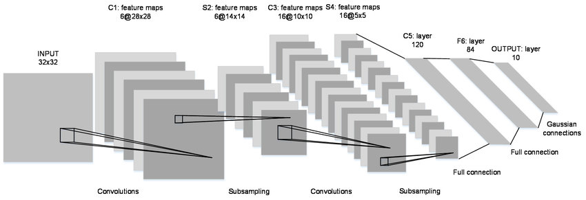

# LeNet

***

LeNet was proposed in 1998, a typical convolutional neural network. It was used for digit recognition and got big success.

The architectural definition of network refers to the following papers:

[1] Y.Lecun, L.Bottou, Y.Bengio, ops.Haffner. [Gradient-Based Learning Applied to Document Recognition](https://ieeexplore.ieee.org/document/726791). Proceedings of the IEEE. 1998.

<div align=center></div>

## Pretrained models

***

The following table lists LeNet mnist checkpoints. The model verifies the accuracy
of Top-1 and Top-5.

|  | MindSpore | MindSpore | | |
|:-----:|:---------:|:--------:|:---------:|:---------:|
| Model | Top-1 (%) | Top-5 (%) | Download | Config |
| LeNet | 98.768 | 1.0 | [model](https://download.mindspore.cn/vision/classification/lenet_mnist.ckpt) | [config](../../../mindvision/classification/config/lenet/lenet.yaml) |

## Training

***

### Parameter description

| Parameter | Default | Description |
|:-----|:---------|:--------|
| device_target | GPU | Hardware device |
| data_url |  | Path to training dataset |
| pretrained | False | Path to pretrained model |
| dataset_sink_mode | True | Data sinking mode |
| num_classes | 10 | Number of dataset classifications |
| batch_size | 32 | Number of batch size |
| repeat_num | 1 | Number of data repetitions |
| momentum | 0.9 | Momentum parameter |
| epoch_size | 10 | Number of epoch |
| keep_checkpoint_max | 10 | Maximum number of checkpoints saved |
| ckpt_save_dir | './lenet' | Save path of checkpoint |
| learning_rate | 0.01 | Number of  learning rate |
| resize | 32 | Resize the height and weight of picture |
| download | False | Download Mnist train dataset |

## Examples

***

### Train

- The following configuration for training.

  ```shell
  python lenet_mnist_train.py --data_url ./mnist --download True
  ```

  output:

  ```text
  Epoch:[0/10], step:[1875/1875], loss:[0.248/0.248], time:7872.273, lr:0.01000.
  Epoch time:14200.658, per step time:7.574, avg loss:0.248
  Epoch:[1/10], step:[1875/1875], loss:[0.028/0.028], time:4733.176, lr:0.01000.
  Epoch time:4733.927, per step time:2.525, avg loss:0.028
  Epoch:[2/10], step:[1875/1875], loss:[0.200/0.200], time:4725.960, lr:0.01000.
  Epoch time:4726.731, per step time:2.521, avg loss:0.200
  Epoch:[3/10], step:[1875/1875], loss:[0.047/0.047], time:4712.884, lr:0.01000.
  Epoch time:4713.662, per step time:2.514, avg loss:0.047
  Epoch:[4/10], step:[1875/1875], loss:[0.002/0.002], time:4672.785, lr:0.01000.
  Epoch time:4673.390, per step time:2.492, avg loss:0.002
  Epoch:[5/10], step:[1875/1875], loss:[0.000/0.000], time:4630.773, lr:0.01000.
  Epoch time:4631.456, per step time:2.470, avg loss:0.000
  Epoch:[6/10], step:[1875/1875], loss:[0.000/0.000], time:4596.333, lr:0.01000.
  Epoch time:4597.269, per step time:2.452, avg loss:0.000
  Epoch:[7/10], step:[1875/1875], loss:[0.031/0.031], time:4682.164, lr:0.01000.
  Epoch time:4682.911, per step time:2.498, avg loss:0.031
  Epoch:[8/10], step:[1875/1875], loss:[0.004/0.004], time:4639.663, lr:0.01000.
  Epoch time:4640.499, per step time:2.475, avg loss:0.004
  Epoch:[9/10], step:[1875/1875], loss:[0.042/0.042], time:4660.191, lr:0.01000.
  Epoch time:4660.966, per step time:2.486, avg loss:0.042
  ```

- The following configuration uses yaml file for training.

  ```shell
  python examples/classification/tools/train_config.py -c mindvision/classification/config/lenet/lenet_mnist.yaml
  ```

  output:

  ```text
  Epoch:[0/10], step:[1875/1875], loss:[0.289/0.289], time:4501.820, lr:0.01000.
  Epoch time:10293.452, per step time:5.490, avg loss:0.289
  Epoch:[1/10], step:[1875/1875], loss:[0.029/0.029], time:2001.829, lr:0.00976.
  Epoch time:2002.693, per step time:1.068, avg loss:0.029
  Epoch:[2/10], step:[1875/1875], loss:[0.094/0.094], time:1905.051, lr:0.00905.
  Epoch time:1905.938, per step time:1.017, avg loss:0.094
  Epoch:[3/10], step:[1875/1875], loss:[0.122/0.122], time:2028.579, lr:0.00794.
  Epoch time:2029.425, per step time:1.082, avg loss:0.122
  Epoch:[4/10], step:[1875/1875], loss:[0.002/0.002], time:2000.762, lr:0.00655.
  Epoch time:2001.407, per step time:1.067, avg loss:0.002
  Epoch:[5/10], step:[1875/1875], loss:[0.000/0.000], time:1850.426, lr:0.00500.
  Epoch time:1851.062, per step time:0.987, avg loss:0.000
  Epoch:[6/10], step:[1875/1875], loss:[0.000/0.000], time:1875.080, lr:0.00345.
  Epoch time:1875.705, per step time:1.000, avg loss:0.000
  Epoch:[7/10], step:[1875/1875], loss:[0.001/0.001], time:1937.989, lr:0.00206.
  Epoch time:1938.506, per step time:1.034, avg loss:0.001
  Epoch:[8/10], step:[1875/1875], loss:[0.000/0.000], time:1964.432, lr:0.00095.
  Epoch time:1964.922, per step time:1.048, avg loss:0.000
  Epoch:[9/10], step:[1875/1875], loss:[0.004/0.004], time:1926.403, lr:0.00024.
  Epoch time:1926.939, per step time:1.028, avg loss:0.004
  ```

### Eval

- The following configuration for eval.

  ```shell
  python lenet_mnist_eval.py  --data_url ./mnist --pretrained True --download True
  ```

  output:

  ```text
  {'Top_1_Accuracy': 0.9876802884615384, 'Top_5_Accuracy': 1.0}
  ```

- The following configuration uses yaml file for eval.

  ```shell
  python examples/classification/tools/eval_config.py -c mindvision/classification/config/lenet/lenet_mnist.yaml
  ```

  output:

  ```text
  {'Top_1_Accuracy': 0.9876802884615384, 'Top_5_Accuracy': 1.0}
  ```

### Infer

- The following configuration for infer.

  ```shell
  python lenet_mnist_infer.py --data_url ./infer --pretrained True
  ```

  output:

  ```text
  {4: 'four'}
  ```
