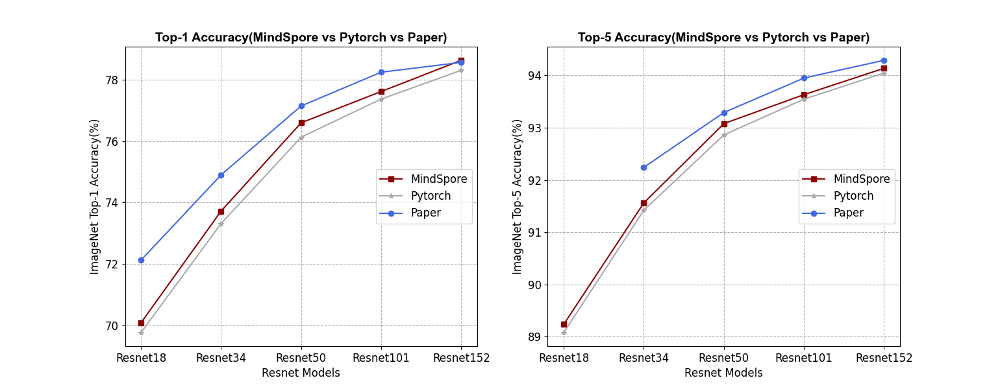

# ResNet

***

ResNet (residual neural network) was proposed by Kaiming He and other four Chinese of Microsoft Research Institute. Traditional convolution network or full connection network will have more or less information loss. At the same time, it will lead to the disappearance or explosion of gradient, which leads to the failure of deep network training. ResNet solves this problem to a certain extent. By passing the input information to the output, the integrity of the information is protected. The whole network only needs to learn the part of the difference between input and output, which simplifies the learning objectives and difficulties.The structure of ResNet can accelerate the training of neural network very quickly, and the accuracy of the model is also greatly improved.

The architectural definition of each network refers to the following papers:

[1] Kaiming He, Xiangyu Zhang, Shaoqing Ren, and Jian Sun. [Deep Residual Learning for Image Recognition](https://arxiv.org/pdf/1512.03385.pdf). arXiv preprint arXiv: 1512.03385, 2015b.

## Performance

***

### Precision comparison line chart

The following line chart shows the accuracy comparison between resnet network and pytorch and paper in Top1 and top5.



## pretrained models

***

All resnet checkpoints were trained with image resolution 224x224. Each model verifies the accuracy
of Top-1 and Top-5, and compares it with that of pytorch and the paper. The table is as follows:

|  | | MindSpore | MindSpore | Pytorch | Pytorch | Paper | Paper | | |
|:-----:|:---------:|:--------:|:---------:|:---------:|:--------:|:--------:|:--------:|:--------:|:--------:|
| Model | Dataset | Top-1 (%) | Top-5 (%) | Top-1 (%) | Top-5 (%) | Top-1 (%) | Top-5 (%) | Download | Config |
| Resnet18 | ImageNet | 70.078 | 89.236 | 69.758 | 89.078 | / | / | [model](https://download.mindspore.cn/vision/classification/resnet18_224.ckpt) | [config](../../../mindvision/classification/config/resnet/resnet18.yaml) |
| Resnet34 | ImageNet | 73.72 | 91.56 | 73.314 | 91.42 | 74.97 | 92.24 | [model](https://download.mindspore.cn/vision/classification/resnet34_224.ckpt) | [config](../../../mindvision/classification/config/resnet/resnet34.yaml) |
| Resnet50 | ImageNet | 76.6 | 93.078 | 76.13 | 92.862 | 77.15 | 93.29 | [model](https://download.mindspore.cn/vision/classification/resnet50_224.ckpt) | [config](../../../mindvision/classification/config/resnet/resnet50_imagenet.yaml) |
| Resnet50 | Cifar10 | 93.79 | 99.85 | / | / | / | / | [model](https://download.mindspore.cn/vision/classification/resnet50_cifar10.ckpt) | [config](../../../mindvision/classification/config/resnet/resnet50_cifar.yaml) |
| Resnet101 | ImageNet | 77.62 | 93.632 | 77.374 | 93.546 | 78.25 | 93.95 | [model](https://download.mindspore.cn/vision/classification/resnet101_224.ckpt) | [config](../../../mindvision/classification/config/resnet/resnet101.yaml) |
| Resnet152 | ImageNet | 78.636 | 94.137 | 78.312 | 94.046 | 78.57 | 94.29 | [model](https://download.mindspore.cn/vision/classification/resnet152_224.ckpt) | [config](../../../mindvision/classification/config/resnet/resnet152.yaml) |

## Training

***

### Parameter description

| Parameter | Default | Description |
|:-----|:---------|:--------|
| model |  | Model Type |
| device_target | GPU | Hardware device |
| data_url |  | Path to training dataset |
| pretrained | False | Load pretrained model |
| run_distribute | True | Distributed parallel training |
| num_parallel_workers | 8 | Number of parallel workers |
| dataset_sink_mode | True | Data sinking mode |
| num_classes | 1000 | Number of dataset classifications |
| batch_size | 64 | Number of batch size |
| repeat_num | 1 | Number of data repetitions |
| momentum | 0.9 | Momentum parameter |
| epoch_size | 90 | Number of epoch |
| keep_checkpoint_max | 10 | Maximum number of checkpoints saved |
| ckpt_save_dir | './resnet' | Save path of checkpoint |
| decay_epoch | 90 | Number of decay epoch |
| lr_decay_mode | cosine_decay_lr | Learning rate decay mode |
| smooth_factor | 0.1 | Label smoothing factor |
| max_lr | 0.1 | maximum learning rate |
| min_lr | 0.0 | minimum learning rate |
| milestone |  | A list of milestone |
| learning_rates |  | A list of learning rates |
| resize | 224 | Resize the image |

## Examples

***

### Train

- The following configuration uses 8 GPUs for training.

  ```shell
  mpirun -n 8 python resnet_imagenet_train.py --model resnet50 --data_url ./dataset/imagenet --lr_decay_mode cosine_decay_lr
  ```

  output:

  ```text
  Epoch:[0/90], step:[2502/2502], loss:[4.573/4.573], time:1095567.210, lr:0.10000
  Epoch time:1106613.360, per step time:442.292, avg loss:4.573
  Epoch:[1/90], step:[2502/2502], loss:[4.375/4.375], time:1091808.393, lr:0.09997
  Epoch time:1091811.163, per step time:436.375, avg loss:4.375
  Epoch:[2/90], step:[2502/2502], loss:[3.904/3.904], time:1094093.746, lr:0.09988
  Epoch time:1094096.121, per step time:437.289, avg loss:3.904
  Epoch:[3/90], step:[2502/2502], loss:[3.745/3.745], time:1071049.615, lr:0.09973
  Epoch time:1071054.215, per step time:428.079, avg loss:3.745
  Epoch:[4/90], step:[2502/2502], loss:[3.125/3.125], time:1073788.254, lr:0.09951
  Epoch time:1073791.104, per step time:429.173, avg loss:3.125

  ...
  ```

- The following configuration uses yaml file for training.

  ```shell
  mpirun -n 8 python examples/classification/tools/train_config.py -c mindvision/classification/config/resnet/resnet50_imagenet2012.yaml
  ```

  output:

  ```text
  Epoch:[0/90], step:[2502/2502], loss:[4.819/4.819], time:1095563.976, lr:0.10000
  Epoch time:1106607.839, per step time:442.289, avg loss:4.819
  Epoch:[1/90], step:[2502/2502], loss:[4.658/4.658], time:1091867.306, lr:0.09997
  Epoch time:1091869.861, per step time:436.339, avg loss:4.658
  Epoch:[2/90], step:[2502/2502], loss:[4.020/4.020], time:1093903.073, lr:0.09988
  Epoch time:1093905.668, per step time:437.212, avg loss:4.020
  Epoch:[3/90], step:[2502/2502], loss:[3.494/3.494], time:1071292.745, lr:0.09973
  Epoch time:1071295.067, per step time:428.175, avg loss:3.494
  Epoch:[4/90], step:[2502/2502], loss:[3.007/3.007], time:1073570.003, lr:0.09951
  Epoch time:1073572.577, per step time:429.086, avg loss:3.007

  ...
  ```

### Eval

- The following configuration for eval.

  ```shell
  python resnet_imagenet_eval.py --model resnet50 --data_url ./dataset/imagenet --pretrained True
  ```

  output:

  ```text
  {'Top_1_Accuracy': 0.7658050576184379, 'Top_5_Accuracy': 0.9306378040973111}  
  ```

- The following configuration uses yaml file for eval.

  ```shell
  python examples/classification/tools/eval_config.py -c mindvision/classification/config/resnet/resnet50_imagenet2012.yaml
  ```

  output:

  ```text
  {'Top_1_Accuracy': 0.7658450704225352, 'Top_5_Accuracy': 0.9307778489116517}
  ```

### Infer

- The following configuration for infer.

  ```shell
  python resnet_imagenet_infer.py --model resnet50 --pretrained True --data_url ./infer
  ```

  output:

  ```text
  {151: 'Chihuahua'}
  ```

<div align=center></div>
