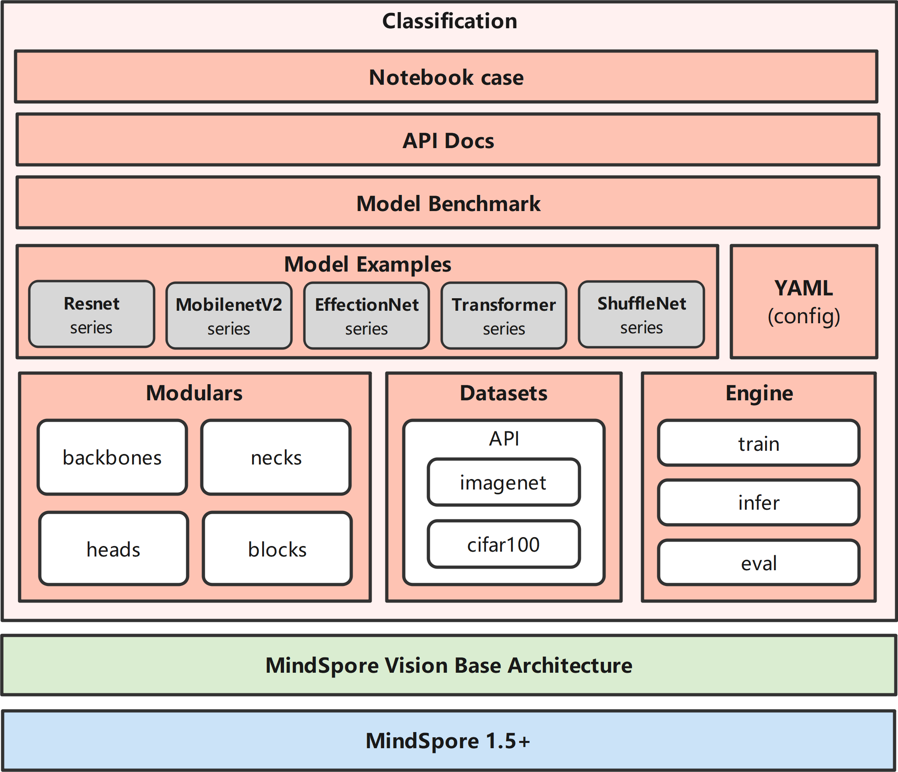

# Classification Documents

## Introduction

MindSpore Vision Classification is an open source image classification toolbox based on MindSpore.

## Major features

- Modular Design

We decompose the classification framework into different components and one can easily construct a customized object classification framework by combining different modules.

### Supported models

- [x] [LeNet](./models/lenet5.py)
- [x] [ResNet](./models/resnet.py)
- [x] [MobileNetV2](./models/mobilenetv2.py)
- [x] [EfficientNet](./models/efficientnet.py)
- [x] [ViT](./models/vision_transform.py)

### Supported datasets

- [x] [CIFAR-10](./dataset/cifar10.py)
- [x] [CIFAR-100](./dataset/cifar100.py)
- [x] [MNIST](./dataset/mnist.py)
- [x] [Fashion-MNIST](./dataset/fashion_mnist.py)
- [x] [IMAGENET](./dataset/imagenet.py)

## Getting Started

Please see [getting_started.ipynb](../../docs/get_started.md) for the basic usage of MindSpore Vision classification.

## Feedbacks and Contact

The dynamic version is still under development, if you find any issue or have an idea on new features, please don't hesitate to contact us via [MindSpore Vision Issues](https://gitee.com/mindspore/vision/issues).

## Contributing

We appreciate all contributions to improve MindSpore Vison classification. Please refer to [CONTRIBUTING.md](../../CONTRIBUTING.md) for the contributing guideline.

## Acknowledgement

MindSpore Vison classification is an open source project that welcome any contribution and feedback.

We wish that the toolbox and benchmark could serve the growing research
community by providing a flexible as well as standardized toolkit to reimplement existing methods
and develop their own new classification methods.

## License

This project is released under the [Apache 2.0 license](LICENSE).