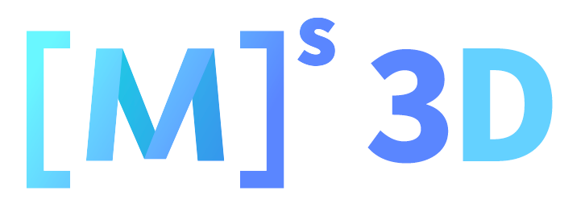
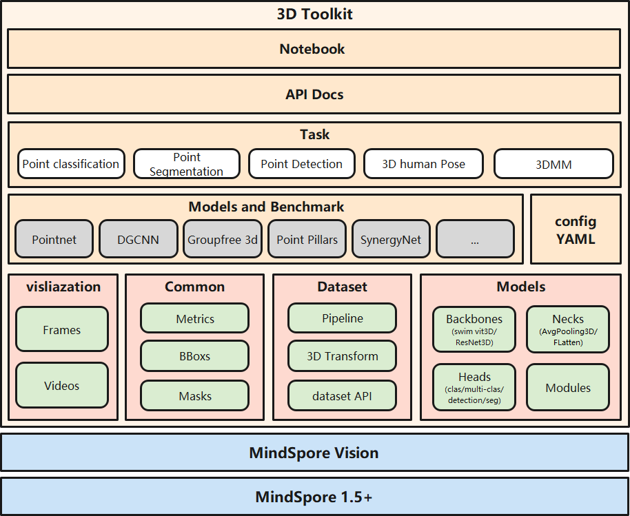

## Introduction

MindSpore Vision 3D is an open source 3D toolbox based on MindSpore.

## Major features

- Modular Design

We decompose the 3D framework into different components and one can easily construct a customized 3D framework by combining different modules.

### Supported models

- [x] [DGCNN]() for Point Clouds classification and Feature Extraction.
- [x] [PointNet]() for Point Clouds classification and Feature Extraction.
- [x] [Pointnet++]() for Point Clouds classification and Feature Extraction.
- [x] [PointPillars]() for 3D Object Detection.
- [x] [Group-Free-3D]() for 3D Object Detection.
- [x] [Point Transformer]() for 3D Semantic segmentation.
- [x] [VIBE]() for 3D Body Pose Estimation.
- [x] [SMPLify-X]() for 3D Body Pose Estimation.
- [x] [SynergyNet]() for 3D Head Reconstruction.

### Supported dataset

## Getting Started

Please see [getting_started.ipynb](../../docs/getting_started.ipynb) for the basic usage of MindSpore Vision.

## Feedback and Contact

The dynamic version is still under development, if you find any issue or have an idea on new features, please don't hesitate to contact us via [MindSpore Vision Issues](https://gitee.com/mindspore/vision/issues).

## Contributing

We appreciate all contributions to improve MindSpore Vison 3D. Please refer to [CONTRIBUTING.md](CONTRIBUTING.md) for the contributing guideline.

## Acknowledgement

MindSpore Vison 3D is an open source project that welcome any contribution and feedback.

We wish that the toolbox and benchmark could serve the growing research
community by providing a flexible as well as standardized toolkit to reimplement existing methods
and develop their own new 3D methods.

## License

This project is released under the [Apache 2.0 license](LICENSE).