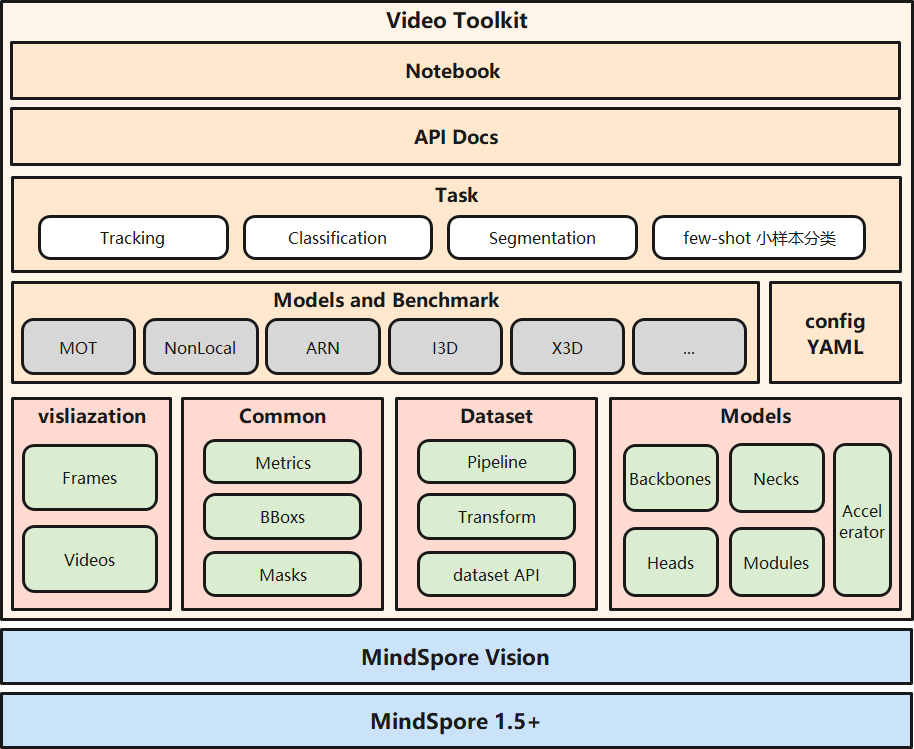

## Introduction

MindSpore Vision Video is an open source Video toolbox based on MindSpore.

## Major features

- Modular Design

We decompose the video framework into different components and one can easily construct a customized video framework by combining different modules.

### Supported models

- [x] [C3D]()
- [x] [R(2+1)d]()
- [x] [fairMOT]()
- [x] [ViST]()
- [x] [VisTR]()
- [x] [I3D]()
- [x] [NonLocal]()
- [x] [X3D]()
- [x] [ARN]()

### Supported dataset

- [x] [HMDB51]()
- [x] [UCF101]()
- [x] [Sports-1M]()
- [x] [Charades]()
- [x] [Kinetics600]()
- [x] [ActivityNet]()
- [x] [THUMOS]()
- [x] [MOT16]()
- [x] [Columbia Consumer Video]()
- [x] [DAVIS]()
- [x] [FBMS]()
- [x] [YouTube Faces]()
- [x] [MSVD]()
- [x] [Collective Activity Dataset]()
- [x] [UCFCrime]()
- [x] [UBI FIGHTS]()

## Getting Started

Please see [getting_started.ipynb](../../docs/getting_started.ipynb) for the basic usage of MindSpore Vision video.

## Feedback and Contact

The dynamic version is still under development, if you find any issue or have an idea on new features, please don't hesitate to contact us via [MindSpore Vision Issues](https://gitee.com/mindspore/vision/issues).

## Contributing

We appreciate all contributions to improve MindSpore Vision video. Please refer to [CONTRIBUTING.md](CONTRIBUTING.md) for the contributing guideline.

## Acknowledgement

MindSpore Vision video is an open source project that welcome any contribution and feedback.

We wish that the toolbox and benchmark could serve the growing research
community by providing a flexible as well as standardized toolkit to reimplement existing methods
and develop their own new video methods.

## License

This project is released under the [Apache 2.0 license](LICENSE).